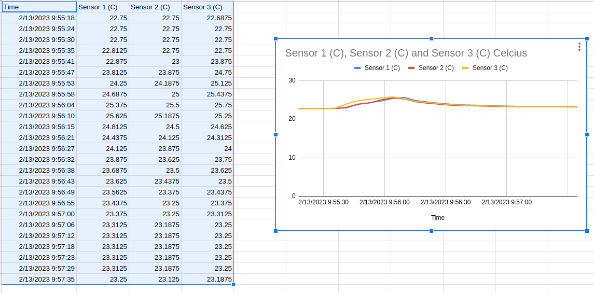

# Homework 9

## Project Timeline
The timeline is in [this](https://github.com/DavidPurdy1/BeagleBoneWaterTurret) repository in the readme file

## MAX31820 temp sensors

Read the temp sensors with python can be found in the demo.py file in the while loop. I use the python library to read the temp sensors.

## Logging in sheets

[Here](https://docs.google.com/spreadsheets/d/13GeS9PyN5yZr8XwM7GGx0iN5WrqnletlRvIIdCEQBhM/edit?usp=sharing) is the url for the sheet and the results of the logging in a chart

# hw09 grading

| Points      | Description | |
| ----------- | ----------- |-|
|  5/5 | Timeline | 
|  3/3 | MAX31820 working
| 12/12| Logging to Sheets
| 20/20| **Total**

*My comments are in italics. --may*

*Nice use of links*